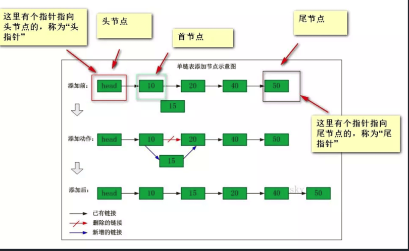
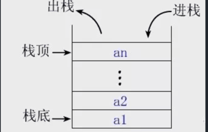
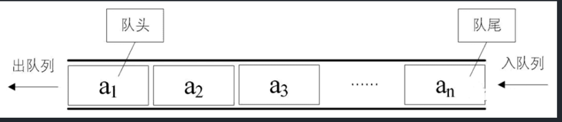

## 线性结构

### 数组

优点

* 存取快速

缺点

* 插入、删除效率低下
* 得事先知道长度
* 需要大块连续的内存块

[ArrayList源码阅读](https://pdai.tech/md/java/collection/java-collection-ArrayList.html)

### 链表


优点

* 内存空间没有限制，不需要连续内存块
* 插入删除速度快

缺点

* 存取慢

类型

* 单向链表: 一个节点 一个指针（下一个节点）

```java
// 单向链表结构
private static class Node<T> {

    /**
     * 数据域
     */
    public T data;

    /**
     * 指针域，指向下一个节点
     */
    public Node<T> next;

    public Node() {
    }

    public Node(T data) {
        this.data = data;
    }

    public Node(T data, Node<T> next) {
        this.data = data;
        this.next = next;
    }
}
```

* 双向链表: 一个节点两个指针（pre 前指针、next 后指针）

```java
private static class Node<E> {
    /**
     * 插入数据节点
     */
    E node;

    /**
     * 前指针
     */
    Node<E> pre;

    /**
     * 后指针
     */
    Node<E> next;

    public Node(E node, Node<E> pre, Node<E> next) {
        this.node = node;
        this.pre = pre;
        this.next = next;
    }
} 
```

* 循环链表 将最后一个节点的next指针指向第一个节点，形成一个圆环。实现根据任意节点查出所有节点

```java
package com.chris.linked.impl;

/**
 * 循环链表简单实现
 *
 * @author 史偕成
 * @date 2023/09/18 12:14
 **/
public class CyclicLinkedList<E> {

    Node<E> head;

    public CyclicLinkedList() {
        this.head = null;
    }

    // 在链表末尾添加一个节点
    public void append(E data) {
        Node<E> newNode = new Node<E>(data);
        if (head == null) {
            head = newNode;
            head.next = head; // 将头节点的下一个节点指向自身，形成循环
        } else {
            Node<E> current = head;
            while (current.next != head) {
                current = current.next;
            }
            current.next = newNode;
            newNode.next = head;
        }
    }

    /**
     * 在链表头部插入一个节点
     * @param data
     */
    public void prepend(E data) {
        Node<E> newNode = new Node<E>(data);
        if (head == null) {
            head = newNode;
            head.next = head;
        } else {
            Node<E> current = head;
            while (current.next != head) {
                current = current.next;
            }
            current.next = newNode;
            newNode.next = head;
            head = newNode;
        }
    }

    /**
     * 删除指定值的节点
     * @param data
     */
    public void delete(E data) {
        if (head == null) {
            return;
        }
        if (head.data == data) {
            Node<E> current = head;
            while (current.next != head) {
                current = current.next;
            }
            if (current == head) {
                // 如果只有一个节点，删除后为空链表
                head = null;
            } else {
                current.next = head.next;
                head = head.next;
            }
            return;
        }
        Node<E> current = head;
        while (current.next != head) {
            if (current.next.data == data) {
                current.next = current.next.next;
                return;
            }
            current = current.next;
        }
    }

    /**
     * 显示链表中的所有节点
     */
    public void display() {
        if (head == null) {
            System.out.println("Circular Linked List is empty.");
            return;
        }
        Node<E> current = head;
        do {
            System.out.print(current.data + " -> ");
            current = current.next;
        } while (current != head);
        // 打印头节点的数据来表示循环结束
        System.out.println(head.data);
    }


    private static class Node<E> {
        E data;
        Node<E> next;

        public Node(E data) {
            this.data = data;
            this.next = null;
        }
    }

    public static void main(String[] args) {
        CyclicLinkedList<Integer> circularLinkedList = new CyclicLinkedList<Integer>();

        circularLinkedList.append(1);
        circularLinkedList.append(2);
        circularLinkedList.append(3);

        System.out.print("Circular Linked List: ");
        circularLinkedList.display(); // 输出：Circular Linked List: 1 -> 2 -> 3 -> 1

        circularLinkedList.prepend(0);

        System.out.print("Circular Linked List after prepend: ");
        circularLinkedList.display(); // 输出：Circular Linked List after prepend: 0 -> 1 -> 2 -> 3 -> 0

        circularLinkedList.delete(2);

        System.out.print("Circular Linked List after delete: ");
        circularLinkedList.display(); // 输出：Circular Linked List after delete: 0 -> 1 -> 3 -> 0
    }
}
```

### 栈（FILO first-in-last-out / LIFO）


****
**特点**

* 先进后出 / 后进先出
* 只能在栈顶进行插入、删除操作
  **实现方式**
* 数组实现：静态栈
* 链表实现：动态栈

****
**适用**

* [JVM 栈帧]()
* [深度优先搜索]()
* [回溯算法](#回溯算法)
* 撤销操作：可以在栈中存储历史操作，在会滚操作时就可以利用特点实现

### 队列(FIFO)


****
**特点**

* 先入先出

**实现方式**

* 数组实现：静态队列
* 链表实现：动态队列